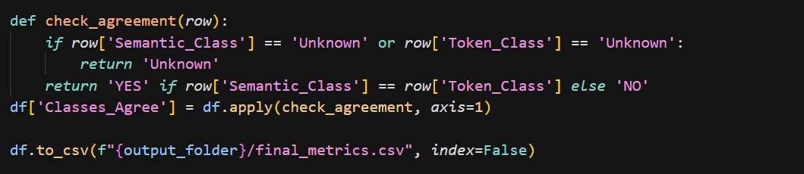

# Lab Assignment 3 Report

- Course: CS202 – Software Tools and Techniques for CSE
- Lab Topic: Multi-Metric Bug Context Analysis and Agreement Detection in Bug-Fix Commits
- Name: Shardul Junagade
- Roll Number: 23110297
- Date: 18th August 2025

---

## 1. Introduction, Setup, and Tools

### 1.1 Introduction
In Lab 2, I had prepared a per-file dataset of bug-fix commits with extracted diffs and model-generated summaries. The purpose of this lab was to extend that dataset with two new perspectives:

- Structural metrics around each fix (Maintainability Index, Cyclomatic Complexity, and Lines of Code) using radon.
- Change magnitude metrics (Semantic similarity with CodeBERT and Token similarity with BLEU).
- Classify each fix as Major or Minor from both lenses and check where they agree (or don’t).

By combining these, I could classify bug fixes as Major or Minor and check where the structural and semantic lenses agreed or conflicted. This is important because commit messages or diffs alone rarely capture how “big” or “complex” a change really is. For example, a small one-line change could drastically alter program behavior.

### 1.2 Environment and Tools
- OS: Windows 11, Terminal: PowerShell 7
- Python: 3.13.7
- Key packages: radon, numpy, pandas, tqdm, nltk, transformers, torch, scikit-learn
- Models: [microsoft/codebert-base](https://huggingface.co/microsoft/codebert-base) (for embeddings)
- Hardware: NVIDIA RTX 4060 Laptop GPU

---

## 2. Methodology and Execution

Notebook Link: [lab3.ipynb](https://github.com/ShardulJunagade/cs202-stt/blob/main/lab3/lab3.ipynb)

### 2.1 Starting point (Lab 2 dataset)

- Input CSV: lab3/lab2_diffs.csv
- Columns included: Commit Hash, Message, File Name, Source Code (before), Source Code (current), Diff, LLM Inference (fix type), Rectified Message

I first loaded the dataset, checked the first 10–20 rows, and verified that there were no missing critical columns. Then, I checked for NaNs in key columns in the dataset.

### 2.2 Baseline Descriptive Stats

From the dataset, I computed the following statistics to understand the dataset:
- Total unique commits and total file entries.
- Average modified files per commit.
- Distribution of fix types from `LLM Inference (fix type)`.
- Most frequently modified filenames and extensions.

The following images show the code and output for these computations:

### 2.3 Structural metrics with radon
For each file, I ran radon on both “before” and “current” sources and recorded:
- Maintainability Index (MI)
- Cyclomatic Complexity (CC)
- Lines of Code (LOC)

I then computed deltas: `MI_Change`, `CC_Change`, `LOC_Change`. Any parsing exceptions are caught and recorded as NaN (those propagate to “Unknown” later). I saved these results to `results/structural_metrics.csv`.

The following image show the code implementation for structural metrics computation:

### 2.4 Change magnitude: semantic vs token similarity

I calculated two complementary metrics on the same before/after code:
- Semantic similarity using CodeBERT embeddings + cosine similarity.
- Token similarity using BLEU with NLTK’s tokenizer (with smoothing).

I added 2 columns for these values to the dataframe and saved the dataset to `results/change_magnitude_metrics.csv`.

The following images show the code implementation for calculating the semantic similarity and token similarity:

### 2.5 Classification and agreement

I classified each fix as Major or Minor using the suggested thresholds:

- Semantic similarity ≥ 0.80 ⇒ Minor, else Major
- Token similarity ≥ 0.75 ⇒ Minor, else Major
- Unknown: if NaN

Then, I compared the two classifications:

- If both matched, Classes_Agree = YES
- If they differed, Classes_Agree = NO
- If either was Unknown, then agreement was also Unknown

I exported the final table to `results/final_metrics.csv` and plotted pie charts for distributions.

---

## 3. Results and Analysis

Final table link : [final_metrics.csv](https://github.com/ShardulJunagade/cs202-stt/blob/main/lab3/results/final_metrics.csv)

Summary of key metrics like structural changes, semantic similarity, and classification agreement:

| Metric | Value |
|--------|-------|
| Mean MI_Change | -0.13 |
| Mean CC_Change | 0.02 |
| Mean LOC_Change | 4.5 |
| Mean Semantic Similarity | 0.9992 |
| Mean Token Similarity | 0.9596 |
| Semantic Classification (Minor) | 96.0% |
| Semantic Classification (Major) | 0.1% |
| Semantic Classification (Unknown) | 3.9% |
| Token Classification (Minor) | 92.6% |
| Token Classification (Major) | 3.5% |
| Token Classification (Unknown) | 3.9% |
| Agreement (YES) | 92.6% |
| Agreement (NO) | 3.5% |

### Visualizations

## 4. Discussion and Conclusion

During this lab, I encountered a few challenges that slowed me down at first. One issue was that Radon sometimes failed when analyzing code written in older versions of Python, which meant I had to either skip those snippets or handle errors gracefully. Another challenge was that Radon itself was a completely new library for me, so I had to spend time going through its documentation and experimenting before I could use it confidently. I also ran into problems with the **NLTK tokenizer setup**—the lab notebook would throw runtime errors until I figured out that the `punkt` package needed to be downloaded separately.

This lab helped me learn a lot. I now have a much better understanding of **structural metrics** like Maintainability Index (MI), Cyclomatic Complexity (CC), and Lines of Code (LOC), and how they can reflect code quality changes. On the other hand, exploring **semantic similarity with CodeBERT** and **token similarity with BLEU** showed me how different lenses can tell very different stories about the same code change. 

## References

- Radon documentation: [https://pypi.org/project/radon](https://pypi.org/project/radon)  
- CodeBERT model (Hugging Face): [https://huggingface.co/microsoft/codebert-base](https://huggingface.co/microsoft/codebert-base)  
- NLTK tokenizer: [https://www.nltk.org/](https://www.nltk.org/)  
- Lab Document: [Google Doc](https://drive.google.com/file/d/1erOvLfZuDeQw798jfHmX3t9MtKl8xmsN/view)