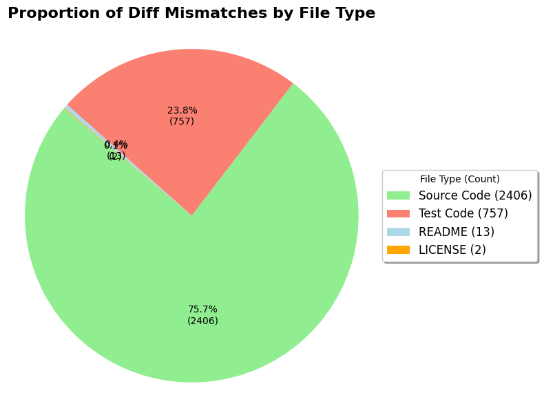

# Lab Assignment 4 Report

- Course: CS202 – Software Tools and Techniques for CSE
- Lab Topic: Exploration of Different Diff Algorithms on Open-Source Repositories
- Name: Shardul Junagade
- Roll Number: 23110297
- Date: 25th August 2025

---

**Repository Link:** https://github.com/ShardulJunagade/cs202-stt/tree/main/lab4

## 1. Introduction, Setup, and Tools

### 1.1 Introduction

In this lab, I compared two diff algorithms — **Myers** and **Histogram** — to see how they behave on real-world open-source repositories.  
The main task was to extract per-file diffs for each modified file in the commit history, identify where the two algorithms produced different results, and analyze whether these mismatches were more common in code files, test files, or documentation.  

**Myers Algorithm:** The Myers algorithm is the **default in Git** and is based on finding the shortest edit script between two versions of a file. It is efficient and works well in general, but sometimes produces diffs that are harder to read, especially when code blocks are moved or reordered. 

**Histogram Algorithm:** The Histogram algorithm, on the other hand, tries to anchor diffs on *rare lines first* (lines that appear less frequently), which often makes the changes more meaningful and easier to follow. 

The motivation for this lab was to understand whether the choice of diff algorithm makes a practical difference for developers, reviewers, and automated tools.  

### 1.2 Environment and Tools
- **Operating System:** Windows 11  
- **Terminal:** PowerShell 7  
- **Code Editor:** Visual Studio Code - Insiders
- **Python version:** 3.13.7  
- **PyDriller version:** 2.8
- **SEART GitHub:** https://seart-ghs.si.usi.ch/
- **Notebooks:**  
  - `lab4/diff_extract.ipynb` (data collection)  
  - `lab4/diff_analyse.ipynb` (analysis and plotting)  

---

## 2. Methodology and Execution

Notebook links: [`lab4/diff_extract.ipynb`](https://github.com/ShardulJunagade/cs202-stt/blob/main/lab4/diff_extract.ipynb) , [`lab4/diff_analyse.ipynb`](https://github.com/ShardulJunagade/cs202-stt/blob/main/lab4/diff_analyse.ipynb)

### 2.1 Repository Selection and Criteria

My selection was based on:
- **Activity:** Projects with regular commits and long histories.  
- **Popularity:** Well-recognized repositories with high stars and forks.  
- **Variety of files:** Containing source code, tests, and documentation.  
- **Language consistency:** All three projects are Python-based, making analysis simpler.  

Normally, I would start with a larger set of repositories using tools like the SEART GitHub Search Engine and then narrow down based on these criteria. The chosen projects already satisfied these requirements.

I selected three well-known Python projects to get varied histories and file types:

1. [psf/requests](https://github.com/psf/requests) - requests is a widely used Python library for making HTTP requests. It is popular because of its simple API, reliability, and extensive use in both academic and industry projects. With over 30,000 commits, 10,000 forks, and 50,000 stars on GitHub, it is considered a highly influential and well-maintained project. Its rich commit history makes it suitable for analyzing diff algorithm discrepancies. The project was selected directly from GitHub due to its popularity and long development history.

    

2. [pallets/flask](https://github.com/pallets/flask) - Flask is a lightweight Python web framework known for its simplicity and flexibility. It is widely adopted in both small and large-scale web applications. Flask has more than 15,000 commits, 6,000 forks, and 65,000 stars on GitHub, reflecting its popularity and active maintenance. The repository contains extensive test suites and documentation, which makes it an ideal candidate for this lab. Its selection was done using GitHub search and project metrics.

    

3. [scikit-learn/scikit-learn](https://github.com/scikit-learn/scikit-learn) - scikit-learn is one of the most important machine learning libraries in Python. It is heavily used in both research and industry for tasks such as classification, regression, clustering, and model evaluation. The repository has over 27,000 commits, 25,000 forks, and 60,000 stars on GitHub, which highlights its active community and long development history. Due to its diverse codebase and well-documented commit history, it was selected as a representative project for this study.

    

These projects have long commit histories, active communities, and include both source code and documentation, making them suitable for this analysis.  

Then I cloned these repositories using the `git clone` command

---

### 2.3 Diff Extraction Pipeline and Discrepancy Handling
I cloned each repository under `lab4/repos/`. Then, I traversed each commit and:
- Extracted modified files (excluding newly added/deleted files).  
- Computed two diffs per file:
  - Myers (`git diff`)  
  - Histogram (`git diff --histogram`)  
I Ignored whitespace and blank line changes using flags `-w` and `--ignore-blank-lines`. I also handled edge cases like if a commit is a root commit, i.e., has no parent.

For each file-modifying commit I stored:
- old_file_path, new_file_path, commit_sha, parent_commit_sha
- commit_message
- diff_myers (plain text), diff_hist (plain text)
- Discrepancy - A discrepancy was marked as **“Yes”** if the Myers and Histogram diffs were different, otherwise **“No”**.  

The following images shows the code implemenation for extracting diffs and handling discrepancies:

After this, now I had extracted a dataset with 95506 entries, out which around 4000 (4.2%) had discrepancies between Myers and Histogram diffs. Then, I saved the extracted data into `lab4/results/diff_analysis.csv`.

### 2.5 File Type Categorization and Statistics
I categorized files into:
- **Source Code** (extensions: .py, .java, .c, .cpp, .h, .js, .ts, .rb, .go, .php) 
- **Test Code** (paths containing `test`, `spec`, or `mock`)  
- **README** (files named README)  
- **LICENSE** (files named LICENSE or COPYING)  
- **Other** (all remaining files)

From rows with `Discrepancy == 'Yes'`, I counted mismatch counts per category.

The following image shows the code implementation for categorizing files:

Finally, I plotted discrepancy distribution pie charts for each file type (Source Code, Test Code, README, and LICENSE) to visually compare how often the two diff algorithms disagreed across different categories.

## 2.6 How to decide which performs better? (Myers vs Histogram)

If I had to automatically determine which algorithm performed better, I would not rely only on the raw mismatch count as we can't figure out which algorithm performed better with just that metric. Instead, I would try to design a small evaluation framework around the usefulness of the produced diff. The basic idea is that a “better” diff should be more consistent, easier to read, and should align with the way developers usually expect changes to be shown.

My approach would be:

1. **Define quality metrics:** For each diff, measure aspects such as number of changed lines reported, length of the diff, and whether moved blocks are detected cleanly. For example, Histogram shows block movements more clearly, while Myers sometimes fragments them into multiple small changes.

2. **Cross-check with file type:** For source code files, I would give preference to the algorithm that minimizes noise (e.g., fewer redundant changes). For text-heavy files like README or LICENSE, correctness is simpler, so the shorter diff is often better.

3. **Ground truth validation:** On a smaller subset, one could ask developers to label which diff looks clearer or more accurate. These labels could then serve as training data for an automatic scoring function.

4. **Automated scoring:** Using the above, each diff can be assigned a score (e.g., based on readability, compactness, and block preservation). Summing these scores across thousands of files would give an aggregate measure of which algorithm is generally more effective.

---

## 3. Results and Analysis

- Total number of modified file diffs analyzed: **95506**
- Number of mismatches found: **4000**
- **Overall discrepancy rate:** Around **4.2%** of all modified file diffs showed a mismatch between Myers and Histogram.

  | File Type | Mismatches |
  |-----------|------------|
  | Source Code | **2406** |
  | Test Code | **757** |
  | README | **12** |
  | LICENSE | **2** |
  | Other | **820** |

- **Source code files** had the most mismatches, since Histogram groups reordered/moved blocks differently than Myers.
- **Test files** also showed mismatches, often due to block movements or repeated patterns.  
- **README and LICENSE files** had very few mismatches, especially after ignoring whitespace/blank lines.  

## 4. Discussion and Conclusion

### 4.1 Challenges
Working with the full commit histories turned out to be quite time-consuming, especially for large projects like scikit-learn. Some commits were huge and took a long time to process, and I also ran into a few issues while saving the results into CSV files. To get around the encoding errors, I had to use surrogate escapes, which made the process more stable. On the positive side, adding the flags to ignore whitespace and blank lines really helped—it reduced a lot of unnecessary noise in the diffs and made the comparisons cleaner.

### 4.2 What I learned:
Through this lab, I got a hands-on understanding of how git diffs actually work and why they matter in practice. Until now, I had only used `git diff` without thinking much about the algorithm behind it. I learned that Git mainly uses two algorithms — Myers and Histogram — and that they can produce different outputs for the same commit.

Working through real repositories helped me see these differences clearly. Myers is the default and works well in most cases, but Histogram often produces cleaner results when code blocks are moved or reordered. This gave me a much clearer picture of how diff algorithms affect the way changes are displayed, and why reviewers or tools might prefer one over the other in certain contexts.

---

## References

- git diff: https://git-scm.com/docs/git-diff
- pydriller: https://github.com/ishepard/pydriller
- SEART GitHub Search Engine
- Lab Document: [Google Doc](https://drive.google.com/file/d/1wXXE9zMZYFjfrX5OjIdYlJKI0oX1knQS/view)
