# Lab Assignment 7 Report (Outline)

- Course: CS202 – Software Tools and Techniques for CSE
- Lab Topic: Reaching Definitions Analyzer for C Programs
- Name: Shardul Junagade
- Roll Number: 23110297
- Date: 15th September 2025

---

Repository/Notebook Link(s): lab7/ (runner: `lab7/run_analysis.py`, code: `lab7/analyzer/`)

[Insert Image: Environment Overview] -> ../images/lab7/1.png
<!-- 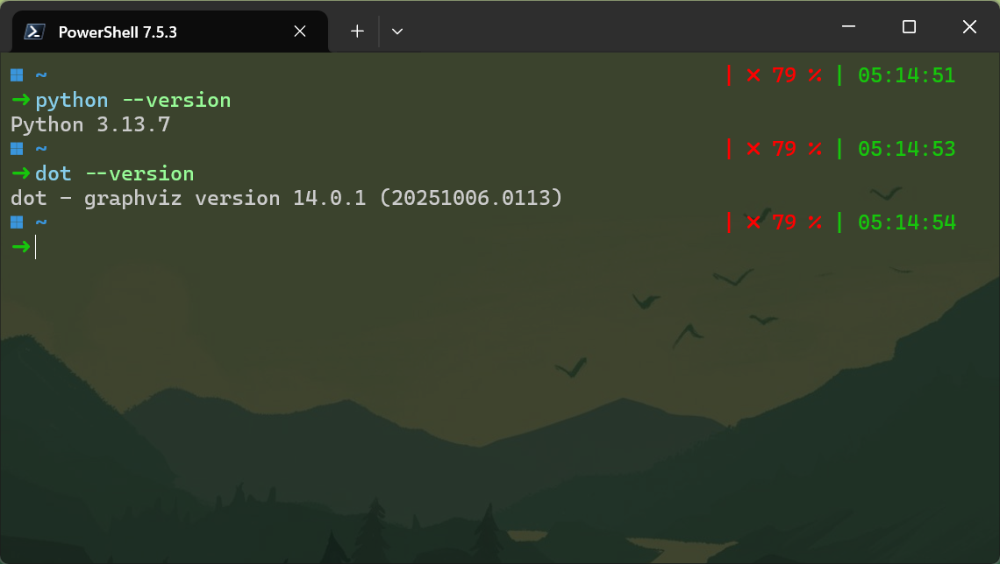 -->

## 1. Introduction, Setup, and Tools

### 1.1 Introduction
I implemented an intraprocedural analyzer that constructed Control Flow Graphs (CFGs) for single-file C programs and ran Reaching Definitions analysis on top of them. I focused on programs with a `main()` function and kept the parsing lightweight so I could iterate quickly. The tool produced DOT/PNG CFGs, per-iteration data-flow tables, a definitions index, an ambiguity report, and basic metrics including cyclomatic complexity.

### 1.2 Environment and Tools
- OS: Windows 11; Terminal: PowerShell 7
- Python: <version I used>
- Required tools: Graphviz (for `dot`), Matplotlib (for plots)
- Editor: VS Code

[Insert Image: Environment Details] -> ../images/lab7/2.png
<!-- 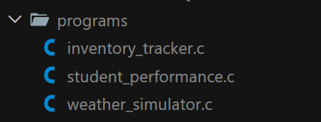 -->

---

## 2. Program Corpus

I selected three single-file C programs (~200–300 LOC each) that had conditionals, loops, and multiple reassignments, as required. I chose programs that were self-contained to avoid interprocedural complexity.

- Program 1: `inventory_tracker.c` — tracked stock levels with multiple conditionals and loop-based updates; good mix of assignments.
- Program 2: `student_performance.c` — computed aggregates with branch-heavy logic around grading thresholds.
- Program 3: `weather_simulator.c` — iterative simulation with nested condition checks and loop-carried updates.

[Insert Image: `lab7/programs` folder snapshot] -> ../images/lab7/3.png
<!-- 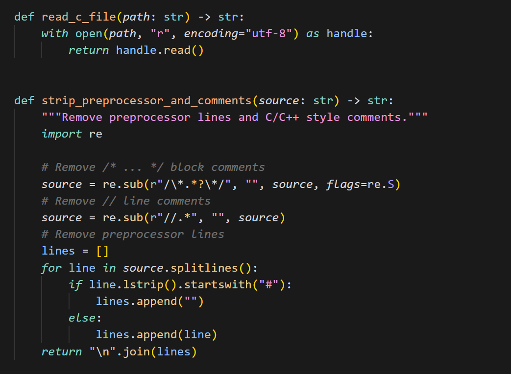 -->

---

## 3. Approach and Implementation

### 3.1 Parsing and Cleaning
I first read the source and stripped preprocessor lines and comments (`analyzer/c_parser.py`):
- Removed `#...` lines and both `/* ... */` and `// ...` comments.
- Extracted only the body of `main()` and tracked its starting line so later line numbers stayed meaningful.
- I kept it deliberately simple; this worked fine for my inputs but wasn’t a full C parser.

[Insert Image: Code snippet – `strip_preprocessor_and_comments` / `extract_main_function_source`] -> ../images/lab7/4.png
<!-- 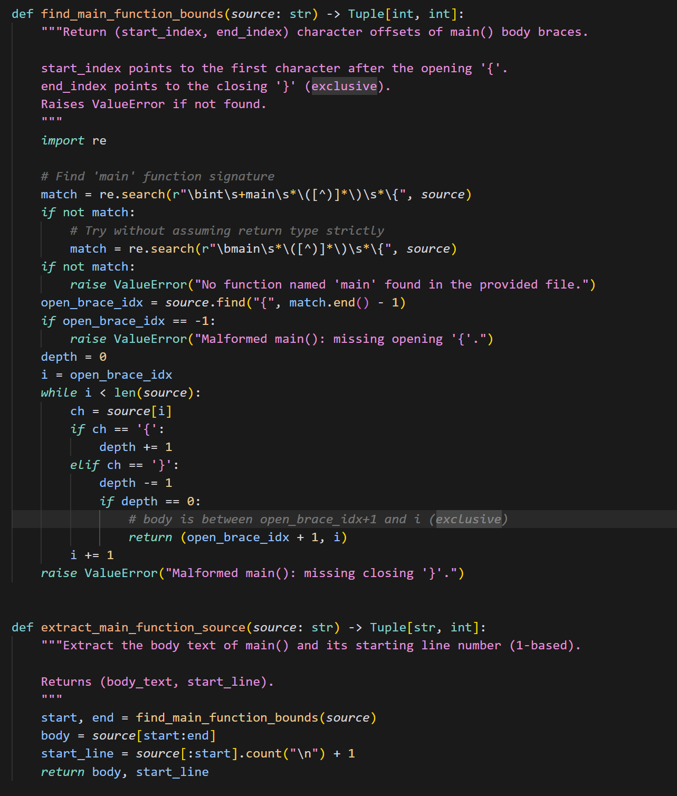 -->

### 3.2 Basic Blocks and CFG Construction
I used leader-based basic block detection per the lab rules (`analyzer/cfg_builder.py`). Blocks were labeled `B0`, `B1`, … and I added edges for sequential flow, conditionals, and simple loops:
- Leaders: first statement, the condition of `if/else if/else/while/for`, the statement after a branch/jump.
- Edges: for `if` I added true/false; for `while/for` I added back-edges from body to condition.
- Jumps like `return/break/continue` terminated flow for that block.

I exported a DOT graph for each program, and rendered it to PNG if `dot` was in PATH.

[Insert Image: Code snippet – `_find_leaders`, `_build_edges_from_blocks`] -> ../images/lab7/5.png
<!-- 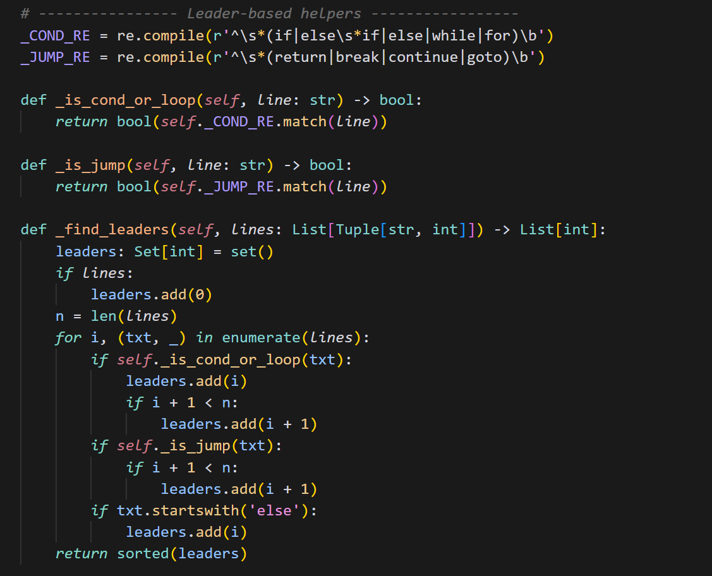 -->

[Insert Image: Sample CFG (PNG)] -> ../images/lab7/6.png
<!-- 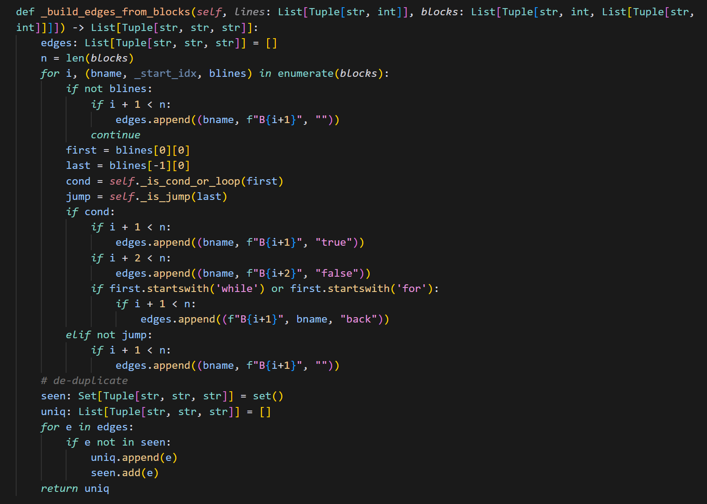 -->

### 3.3 Definition Extraction
For each statement, I extracted defined variables and created unique definition IDs (`D1`, `D2`, …):
- Handled declarations like `int x = 0;`, `int x, y;` and simple assignments including compound ops like `+=`.
- Counted increments/decrements as definitions.
- Stored each definition with statement text, block ID, and line number.

I wrote a Markdown table (`definitions.md`) for quick reference.

[Insert Image: Code snippet – `_extract_defined_variables_from_text`] -> ../images/lab7/7.png
<!-- 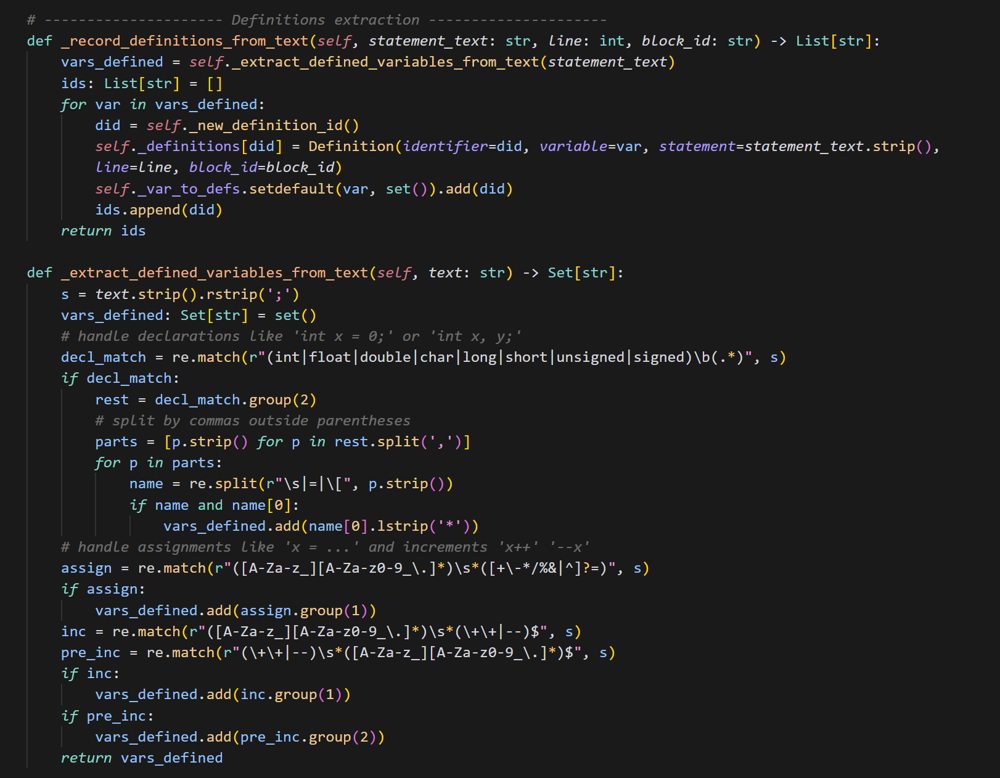 -->

[Insert Image: `definitions.md` preview] -> ../images/lab7/8.png
<!-- 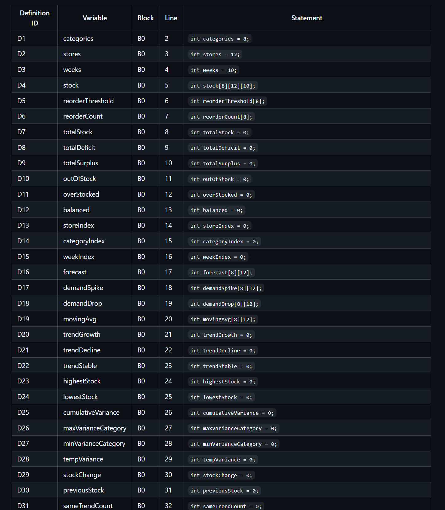 -->

### 3.4 gen/kill Sets per Block
I computed `gen[B]` as the latest definitions per variable within a block, in program order; `kill[B]` as all other definitions of the same variables seen elsewhere. I initialized `in[B]` to `{}` and `out[B]` to `gen[B]`.

[Insert Image: Code snippet – `_compute_gen_kill_sets`] -> ../images/lab7/9.png
<!-- 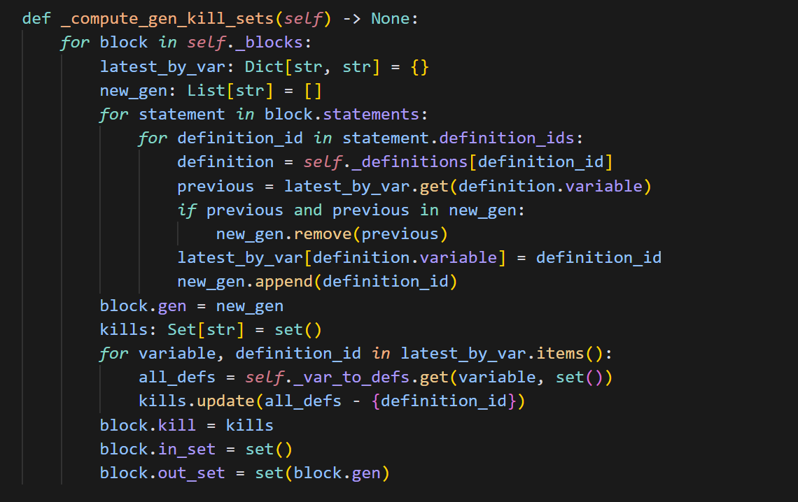 -->

### 3.5 Reaching Definitions (Data-Flow)
I implemented the standard forward data-flow equations (`analyzer/dataflow.py`):
- `in[B] = ⋃ out[P]` over predecessors `P`
- `out[B] = gen[B] ∪ (in[B] − kill[B])`

I iterated until the sets stopped changing. I recorded every iteration as a snapshot and wrote a Markdown table with `gen/kill/in/out` for each block per iteration.

[Insert Image: Code snippet – `compute_reaching_definitions`] -> ../images/lab7/10.png
<!-- 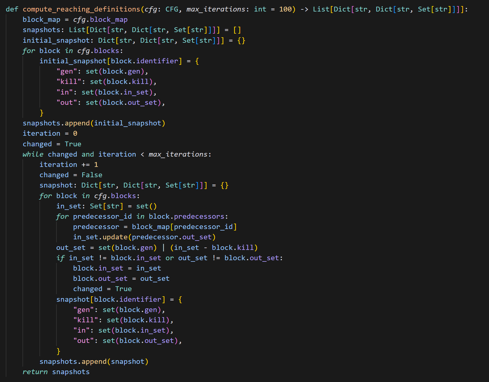 -->

[Insert Image: `reaching_definitions_iterations.md` preview] -> ../images/lab7/11.png
<!-- 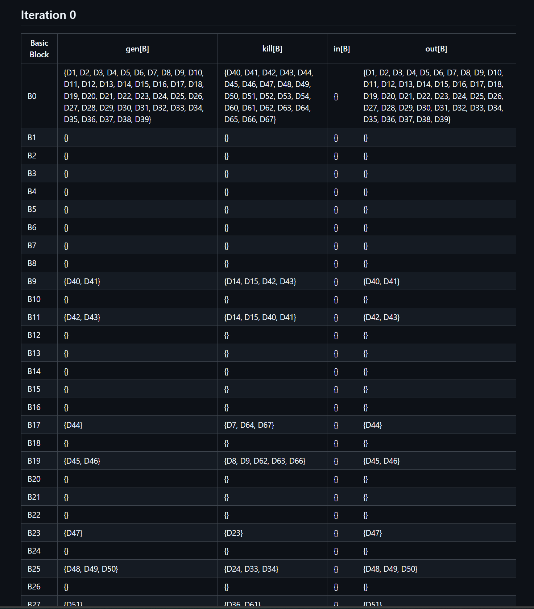 -->

### 3.6 Ambiguity Detection
After convergence, I flagged blocks where a variable had more than one reaching definition in `in[B]` (`find_ambiguous_variables`). I summarized them with the corresponding statements for context (`ambiguity.md`).

[Insert Image: `ambiguity.md` preview] -> ../images/lab7/12.png
<!-- 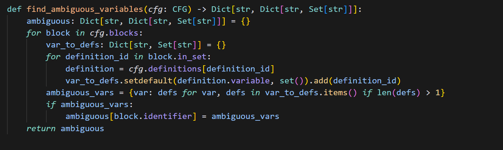 -->

### 3.7 Runner and Outputs
The runner (`lab7/run_analysis.py`) processed all `.c` files in `lab7/programs/` and wrote per-program outputs to `lab7/output/<program>/`:
- `cfg.dot` (+ `cfg.png` if Graphviz was available)
- `definitions.md`
- `reaching_definitions_iterations.md`
- `ambiguity.md`
- `summary.json` (nodes, edges, CC)

It also wrote an overall `metrics_summary.md` and, if Matplotlib was available, a bar chart `cyclomatic_complexity.png` at `lab7/output/`.

Note: In my run, Graphviz wasn’t on PATH, so I kept the DOT files (`cfg.dot`) for each program and skipped PNG rendering.

[Insert Image: `metrics_summary.md` preview] -> ../images/lab7/13.png
<!-- 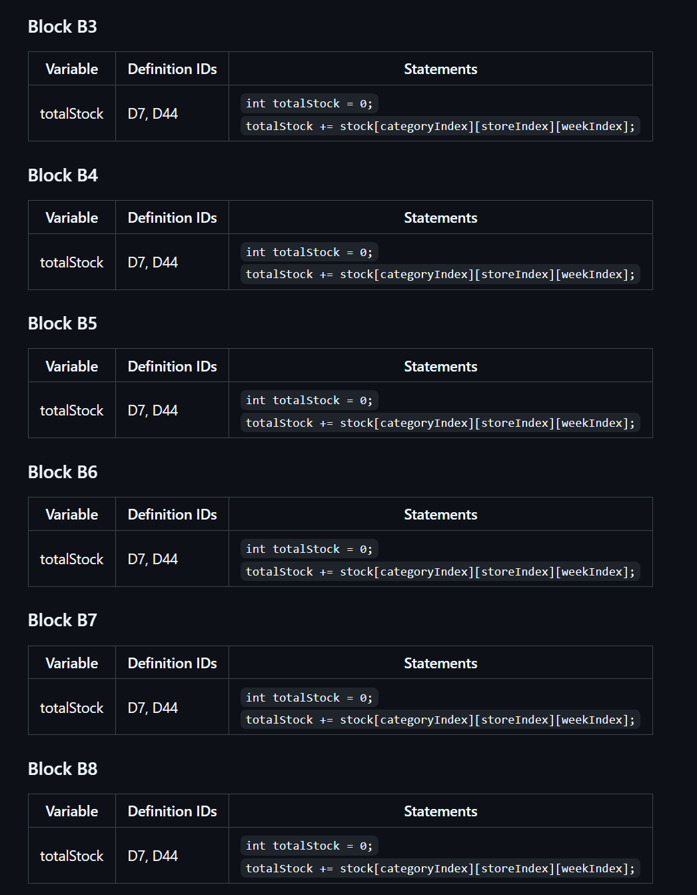 -->

[Insert Image: Cyclomatic Complexity Chart] -> ../images/lab7/14.png
<!-- 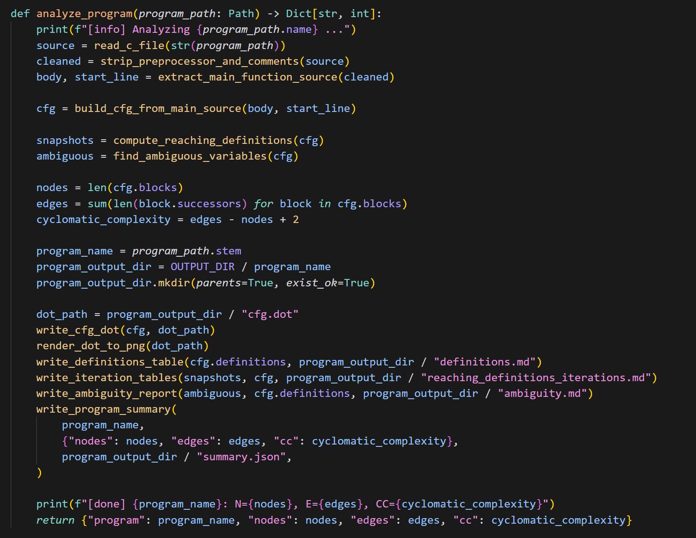 -->

---

## 4. Results

### 4.1 CFG and Metrics
For each program, I reported the number of nodes (basic blocks), edges, and cyclomatic complexity `CC = E − N + 2`. The chart helped me compare CCs across the three programs at a glance.

Actual metrics from my run (`lab7/output/metrics_summary.md`):

| Program | Nodes (N) | Edges (E) | Cyclomatic Complexity (CC) |
|---------|-----------|-----------|----------------------------|
| inventory_tracker | 76 | 126 | 52 |
| student_performance | 59 | 98 | 41 |
| weather_simulator | 76 | 120 | 46 |

[Insert Image: Small gallery of 3 CFG PNGs] -> ../images/lab7/15.png
<!-- 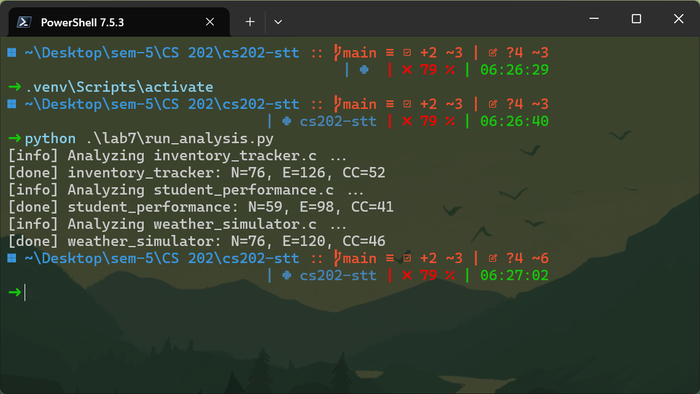 -->

### 4.2 Reaching Definitions Tables
I skimmed early iterations to sanity-check propagation, and I confirmed convergence when tables stopped changing. I then used the final snapshot to interpret variable reachability.

[Insert Image: Selected iteration (final) table] -> ../images/lab7/16.png
<!-- 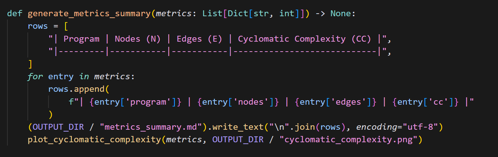 -->

### 4.3 Ambiguity Highlights
I listed a few examples where variables had multiple reaching definitions at a program point and explained why (e.g., different branches or loop-carried definitions).

[Insert Image: Ambiguity example (table rows)] -> ../images/lab7/17.png
<!-- 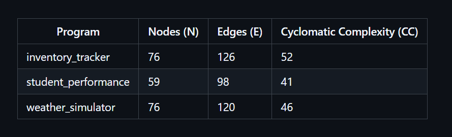 -->

---

## 5. Discussion and Reflection

### 5.1 Challenges
- Getting leader heuristics to play nicely with `else if` and loops; I kept it simple, which worked for my inputs but isn’t a full control-flow reconstructor.
- Avoiding extra noise from braces and empty lines; I filtered standalone `{`, `}`, `;` lines early.
- Ensuring Graphviz was installed and on PATH; I fell back to DOT-only when `dot` wasn’t available.

### 5.2 What I Would Improve Next
- Swap the lightweight parsing for a proper C front-end (e.g., `pycparser`) to cover more syntax and nesting reliably.
- Refine CFG edges for more complex constructs and labels.
- Add unit tests for tricky statements (declarations with pointers/arrays, compound statements).

---

## 6. How I Ran It (Short Notes)
- I placed three `.c` files in `lab7/programs/`.
- I activated my virtual environment and ensured Graphviz and Matplotlib were installed.
- I ran the runner, which generated outputs under `lab7/output/`.

Artifacts generated per program (`lab7/output/<program>/`): `cfg.dot`, `definitions.md`, `reaching_definitions_iterations.md`, `ambiguity.md`, `summary.json`. At the folder root: `metrics_summary.md` (and optionally `cyclomatic_complexity.png`).

[Insert Image: Output folder tree] -> ../images/lab7/18.png
<!--  -->

---

## 7. References
- Lecture 7 slides
- Data-flow analysis: https://en.wikipedia.org/wiki/Data-flow_analysis
- Graphviz: https://graphviz.org/
- PyGraphviz (optional): https://pygraphviz.github.io/

---

## Image Notes
- Use the convention `../images/lab7/<index>.png` from this report’s location.
- Replace the “Insert Image” lines with actual image tags when you have screenshots. Keep alt text specific (e.g., program name or focus of the figure).
