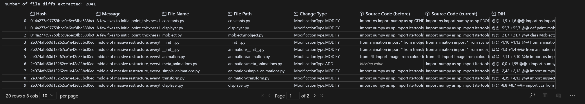

# Lab Assignment 2 Report

- Course: CS202 – Software Tools and Techniques for CSE
- Lab Topic: Mining Bug-Fixing Commits, LLM Inference, Rectifier, and Evaluation
- Name: Shardul Junagade
- Roll Number: 23110297
- Date: 7th September 2025

---

## 1. Introduction, Setup, and Tools

### 1.1 Introduction
This lab focused on mining open-source repositories to study bug-fixing commits and commit message alignment. I implemented a pipeline to:
1. Identify bug-fixing commits from a real-world project.  
2. Extract file-level diffs from those commits.  
3. Use a pre-trained LLM to generate concise summaries for each file-level change.  
4. Rectify those messages to make them more precise and context-aware.  
5. Evaluate the quality of developer, LLM, and rectified messages using semantic similarity with CodeBERT.

The motivation behind this pipeline was that commit messages are not always reliable indicators of what a change actually fixes. Developers may batch multiple fixes, write vague messages, or skip details. Automated tools and rectifiers can help make these messages more consistent and useful.

### 1.2 Environment and Tools
- **Operating System:** Windows 11
- **Terminal:** Powershell 7  
- **Python:** 3.13.7
- **Environment Manager:** uv
- **PyTorch:** 2.8 (with CUDA 12.9)  
- **Transformers:** 4.56  
- **PyDriller:** 2.8
- **Models used:**  
  - [`mamiksik/CommitPredictorT5`](https://huggingface.co/mamiksik/CommitPredictorT5)` (LLM Inference)  
  - [`codellama:7b`](https://ollama.com/library/codellama) via Ollama (Rectifier)
  - [`microsoft/codebert-base`](https://huggingface.co/microsoft/codebert-base) (Evaluation)  
- **Repository analyzed:** [3b1b/manim](https://github.com/3b1b/manim)  


---

## 2. Methodology and Execution

### 2.1 Repository Selection

For this lab, I chose the repository **3b1b/manim**. Manim (short for Mathematical Animation Engine) is a Python library that started with Grant Sanderson’s 3Blue1Brown channel and has since grown into a large open-source project. It is mainly used to create mathematical animations and visualizations, and because of its popularity it now has a wide contributor base and frequent updates.

I felt Manim was a good choice because it’s not just an academic toy project but a tool actually used by educators, researchers, and content creators. That also means its commit history has plenty of real bug fixes to study, which fits well with the aim of this assignment.

#### Selection Criteria


While narrowing down the repository, I kept the following points in mind:

1. **Number of commits:** Manim has more than **6300 commits**, which is large enough to give me enough bug-fixing commits for analysis.

2. **Popularity:** With around **78k stars** and **6.7k forks**, the project has a huge user base and community involvement, so the data is representative of real usage.

3. **Programming language:** The project is written in **Python**, which works well since the lab tools like PyDriller and radon are also Python-based.

4. **Relevance:** Since Manim deals with mathematical visualization and graphics, correctness and stability are very important. That makes bug-fixing commits here especially meaningful to analyze.

5. **Active development:** The repo is still very active, with the last commit in June 2025 and contributions from over **160 developers**, showing that the project is maintained and evolving.

Based on these reasons, Manim seemed like a balanced and practical choice for carrying out this lab. Then I cloned the repository locally using the `git clone <URL>` command.


### 2.2 Identifying Bug-Fixing Commits 

Notebook Link - [bugfix_commits.ipynb](https://github.com/ShardulJunagade/cs202-stt/lab2/bugfix_commits.ipynb)

I first defined a heuristic to detect bug-fixing commits. I scanned commit messages for keywords such as:  
`fix, bug, patch, error, issue, defect, crash, flaw, repair, resolve, solve, fail, leak, vulnerability`.  

This simple keyword filter is fast and transparent. The downside is that it may miss commits where developers did not explicitly mention a bug (false negatives), or capture irrelevant commits where the keyword appeared casually (false positives).

Using PyDriller, I traversed the commit history of the **manim** repository and stored each matching commit in a CSV (`bugfix_commits.csv`) with the following fields:  
- Commit hash  
- Commit message  
- Parent hashes  
- Is merge commit?  
- Modified files

The following code snippet shows the implementation:


I traversed 6,344 commits, out of which, the keyword filter flagged 1358 as bug-fix candidates (~21%).


### 2.2 Extracting Per-File Diffs

Notebook Link: [diff_extract_and_llm_infer.ipynb](https://github.com/ShardulJunagade/cs202-stt/lab2/diff_extract_and_llm_infer.ipynb)

Since commits often modify multiple files, I processed each file separately. For each bug-fixing commit. I extracted the before and after sources codes for each modified file and also stored metadata such as filename, change type, and the git diff.

The following image shows the code implementation:


After running the code, I extracted 2041 file-level diffs and saved these entries to `diffs_per_file.csv`.




### 2.3 LLM inference of “fix type”

Notebook Link: [diff_extract_and_llm_infer.ipynb](https://github.com/ShardulJunagade/cs202-stt/lab2/diff_extract_and_llm_infer.ipynb)

I used the Hugging Face model **CommitPredictorT5** to infer the type of fix from the diff. I gave the following prompt template to the pretrained model.
```
File: <filename>
Diff: <diff>
```
The model generated concise commit-style summaries (max length = 64 tokens). These were appended to the CSV as an extra column: *LLM Inference (fix type)* and I saved this dataset to `diffs_per_file_with_llm_infer.csv`. This allowed direct comparison between the developer written commit messages and the LLM predictions.

The following code snippet shows the implementation:


### 2.4 Rectifier Formulation 

Notebook Link: [ollama_rectifier.ipynb](https://github.com/ShardulJunagade/cs202-stt/lab2/ollama_rectifier.ipynb)

Developer messages and LLM outputs can still be vague or misaligned, especially when multiple files are involved. Many times developers may not clearly specify the bug or issue being addressed. Developers often combine multiple changes/fixes in a single commit and the LLM may not capture all relevant context. To improve clarity, I designed a rectifier with the following rules:

- Input: file name, change type, diff, and optionally developer + LLM messages.  
- Output style: `[file]: Fix <bug/issue> in <component> by <specific action>`  
- Keep messages short (< 20 words) and avoid vague verbs.

I implemented this rectifier with **Ollama + codellama:7b** for local inference on my NVIDIA RTX 4060 machine and added 1 more column named *Rectified Message* to the CSV for the rectified messages. I saved the results to `ollama_rectified_commits.csv`.

The following image shows the code implementation for the rectifier:


### 2.5 Evaluation with CodeBERT 

Notebook Link: [ollama_evaluation.ipynb](https://github.com/ShardulJunagade/cs202-stt/lab2/ollama_evaluation.ipynb)

To measure how well each message aligned with its code change, I used **microsoft/codebert-base** to compute cosine similarity scores between the diff text and each message variant:  
- Developer message  
- LLM inference  
- Rectified message  

I decided to keep the threshold for precision at 0.9. A score > 0.9 was considered “precise.” This allowed me to answer the three research questions (RQ1–RQ3). I saved these results to `ollama_scores_codebert.csv`.

The following image shows the code implementation for the evaluation:


We can see that the developer messages had a precision hit rate of 91%, the LLM inference messages had a hit rate of 92%, and the rectified messages improved the hit rate to 100%. This indicates that the rectifier was effective in enhancing the alignment between the messages and the code changes.


## 3. Results and Analysis

**Bug-fixing commits found:** 1358  
**File-level diffs extracted:** 2041  

Developer Message vs LLM Inference vs Rectified Message

| Developer Message        | LLM Inference        | Rectified Message                |
|--------------------------|----------------------|----------------------------------|
| A few fixes to initial point_thickness implementation| add missing constants | `[constants.py]: Fix default point thickness to be 4 in DEFAULT_POINT_THICKNESS by specifying it explicitly. |
| A few fixes to initial point_thickness implementation | add nudge to displayer.py | Fix potential offset issue in point_thickness by adjusting the thickness of a plus-sign-shaped pixel arrangement to ensure correct rendering on high-quality displays. |
| A few fixes to initial point_thickness implementation | add missing docstring | Fix inconsistent point_thickness implementation in Mobject1D and Mobject2D by specifying a default value for the attribute. |

| RQ  | Message Type        | Hit Rate (threshold = 0.9) |
|-----|---------------------|----------------------------|
| RQ1 | Developer messages  | ~91%                       |
| RQ2 | LLM inference       | ~93%                       |
| RQ3 | Rectified messages  | 100%                       |


Developer messages were often short and lacked detail, lowering their alignment scores. The LLM inference was generally good but sometimes missed context that the rectifier captured.

My rectifier is able to consistently produce high-quality, precise messages. This is mainly because of 3 reasons:

1. **Better Large Language Model (LLM)**: The use of a more advanced LLM for inference likely contributed to the improved message quality. The LLM was able to better understand the context and nuances of the code changes, resulting in more accurate and relevant messages.

2. **Focused Context**: By using the specific file name and change type as part of the input, the rectifier can generate messages that are more closely aligned with the actual code changes being made. This helps to reduce ambiguity and improve precision.

3. **Structured Output**: The output format of the rectifier is designed to be concise and specific, which helps to ensure that the messages are clear and actionable.


## 4. Discussion and Conclusion

**Challenges faced:**

During the lab, I faced a few challenges that slowed me down initially. PyDriller, for example, was a new library for me, and I needed some time to get comfortable with its API and how to extract the right commit-level information. Another difficulty came from the keyword-based heuristic I used to identify bug-fixing commits. While it worked reasonably well, it sometimes missed commits where developers didn’t explicitly mention bug-related terms, and on the other hand it also pulled in a few extra commits that weren’t true bug fixes. Finally, token limits posed a practical issue—some of the larger diffs had to be truncated before being passed to the model, and this occasionally hurt the accuracy of the LLM’s generated summaries.


**Lessons learned:**  

Working through these issues taught me a few important lessons. I found that analyzing changes at the file level and then applying rectification added real value, because it made commit messages more precise and easier to interpret. I also realized that building a pipeline by combining several tools—PyDriller for mining, Hugging Face models for inference, Ollama for rectification, and CodeBERT for evaluation—can be powerful, but it also demands a lot of care in data handling. Even small oversights, like inconsistent CSV column names, can break later steps in the workflow.
 

**Conclusion**

Overall, the end-to-end pipeline—from mining commits to generating diffs, running LLM inference, rectifying the outputs, and finally evaluating them—proved to be quite workable. The rectifier in particular helped improve the quality of commit messages, often making them more specific and useful than both the original developer-written messages and the raw LLM predictions. Although the approach is not perfect, it serves as a strong starting point for building datasets and improving maintainability in open-source projects.


## 5. References

- PyDriller: https://pydriller.readthedocs.io
- Hugging Face Transformers: https://huggingface.co/docs/transformers
- CodeBERT (microsoft/codebert-base): https://huggingface.co/microsoft/codebert-base
- CommitPredictorT5 (mamiksik/CommitPredictorT5): https://huggingface.co/mamiksik/CommitPredictorT5
- Ollama: https://ollama.ai
- Repository analyzed (manim): https://github.com/3b1b/manim
- Lab Document: [Google Doc](https://drive.google.com/file/d/1L4pCGQCekeELjgOJ4HxQ-Tso0QaOKIDf/view)
